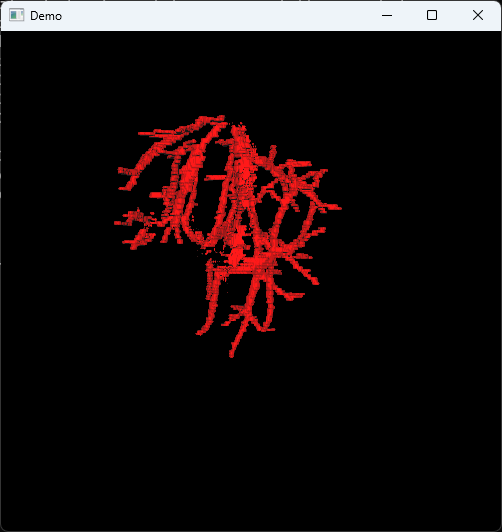

[](https://opensource.org/licenses/MIT)

# Marching Cubes
I implemented the marching cubes algorithm and used it to visualize 3d segmentation of medical images.



## Usage
1. Download the latest release [here](https://github.com/datnx/marching-cubes/releases/download/v1.0.0/marching-cubes-v1.0.zip).
2. Extract archive contents.
3. Run visualize.exe.
4. Select the provided NIFTI file or a binary NIFTI file of your own.

## Controls
* `LMB` - drag to rotate.
* `RMB` - reset view.
* `ESC` - close application.

## Building

### Windows
Tested on: Windows 11 Pro version 23H2

Prerequisites
* MSVC 19.00 or higher
* CMake 2.8 or higher

```
git clone --recursive https://github.com/datnx/marching-cubes.git
cd marching-cubes
mkdir build
cmake -S . -B build
```

## Dependencies
* [freeglut](https://github.com/freeglut/freeglut)
* [imgui](https://github.com/ocornut/imgui)
* [glew](https://github.com/nigels-com/glew)
* [glm](https://github.com/g-truc/glm)

## License
```
Copyright (c) 2024 Dat Nguyen

Permission is hereby granted, free of charge, to any person obtaining a copy of this software and 
associated documentation files (the "Software"), to deal in the Software without restriction, 
including without limitation the rights to use, copy, modify, merge, publish, distribute, sublicense,
and/or sell copies of the Software, and to permit persons to whom the Software is furnished to do so, 
subject to the following conditions:

The above copyright notice and this permission notice shall be included in all copies or substantial
portions of the Software.

THE SOFTWARE IS PROVIDED "AS IS", WITHOUT WARRANTY OF ANY KIND, EXPRESS OR IMPLIED, INCLUDING BUT NOT 
LIMITED TO THE WARRANTIES OF MERCHANTABILITY, FITNESS FOR A PARTICULAR PURPOSE AND NONINFRINGEMENT. 
IN NO EVENT SHALL THE AUTHORS OR COPYRIGHT HOLDERS BE LIABLE FOR ANY CLAIM, DAMAGES OR OTHER LIABILITY,
WHETHER IN AN ACTION OF CONTRACT, TORT OR OTHERWISE, ARISING FROM, OUT OF OR IN CONNECTION WITH THE 
SOFTWARE OR THE USE OR OTHER DEALINGS IN THE SOFTWARE.
```